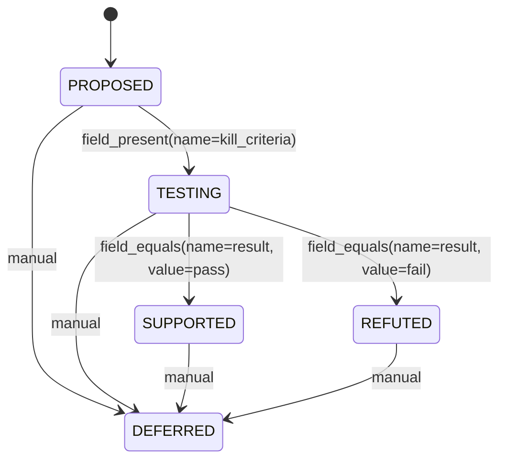

# @beomjk/state-engine

Declarative state lifecycle engine for typed entities.

Define transition rules in TypeScript, get compile-time safety and auto-generated spec docs — from the same source of truth.

[](https://www.npmjs.com/package/@beomjk/state-engine)
[](https://github.com/beomjk/state-engine/actions)
[](https://bundlephobia.com/package/@beomjk/state-engine)
[]()

## Why?

This library was extracted from [EMDD](https://github.com/beomjk/emdd) (Evolving Mindmap-Driven Development), where knowledge graph nodes — hypotheses, experiments, findings — each follow their own lifecycle with conditions that depend on the graph structure.

Existing state machine libraries either lack compile-time safety for state/transition names, or are too heavy for what is fundamentally a simple evaluation problem. **state-engine** takes a different approach:

- **TypeScript _is_ the config** — `as const` generics catch misspelled statuses and unregistered presets at compile time
- **Named preset registry** — conditions are named functions, not anonymous guards; they're testable, reusable, and show up in generated docs
- **Context injection** — the engine doesn't know about your graph, DB, or API; you inject it via `createEngine<TContext>()`, and presets receive it
- **Pure evaluation** — the engine never mutates state; it only answers "is this transition valid?" and "what can this entity transition to?"
- **Multi-entity cascade** — the orchestrator propagates state changes across related entities via BFS, with full causal tracing
- **Schema to docs** — generate Markdown tables and Mermaid diagrams from the same definition object

|                | XState       | machina.js | **state-engine**                       |
| -------------- | ------------ | ---------- | -------------------------------------- |
| Config format  | JS object    | JS object  | **TS-as-Config (type inference)**      |
| Guard style    | Inline funcs | Hooks      | **Named preset registry**              |
| Type safety    | TS support   | Weak       | **`as const` compile-time guarantees** |
| Doc generation | None         | None       | **Schema to Markdown + Mermaid**       |
| Multi-entity   | None         | None       | **BFS cascade with causal tracing**    |
| Bundle size    | ~40 KB       | ~15 KB     | **< 5 KB (zero deps)**                |
| Complexity     | Statecharts  | Medium     | **Intentionally flat FSM**             |

## Install

```bash
npm install @beomjk/state-engine
```

Requires TypeScript 5.0+ and Node 20+. Zero runtime dependencies.

> **Note:** `Entity` requires `status: string`. If your domain objects have optional status (e.g., newly created nodes), narrow the type before passing to the engine — entities without a status are not valid state machine participants.

## Concepts

This section explains how state-engine thinks. Understanding these ideas makes the API intuitive.

### Pure evaluation

The engine never mutates your entities. Every call — `evaluate`, `validate`, `getValidTransitions` — takes an entity and returns a result. The engine has no internal state, no event queue, no side effects.

```typescript
const result = engine.validate(entity, context, rules, 'TESTING', manual);
// result is { valid: true, rule, matchedIds } or { valid: false, reason }
// entity is unchanged
```

This matters because:

1. **Testability** — evaluate the same entity against different contexts without setup or teardown.
2. **Safety** — no accidental state corruption; the engine cannot put your data in an inconsistent state.
3. **Consumer owns state** — you decide when and how to persist changes. The engine answers questions; your application acts on the answers.

### Three-layer validation

When you call `validate()`, the engine checks three layers in order:

1. **Auto rules** — iterate rules matching current status and target. If any rule's conditions all pass, return `{ valid: true, rule }`.
2. **Manual fallback** — if no auto rule matched, check `manualTransitions` for a matching `from` (or `'ANY'` wildcard). Return `{ valid: true, rule: null }`.
3. **Invalid** — return `{ valid: false, reason }`.

Auto rules represent condition-driven transitions (the system decides). Manual transitions represent user-initiated overrides (a human decides). Conditions are always checked first — a manual transition only fires when no auto rule applies.

### AND-only conditions, OR via multiple rules

All conditions within a single rule are conjunctive — every condition must pass:

```typescript
{
  from: 'TESTING', to: 'SUPPORTED',
  conditions: [
    { fn: 'field_equals', args: { name: 'result', value: 'pass' } },
    { fn: 'has_evidence', args: { min: 2 } },
  ]
  // Both must be true
}
```

If you need disjunction, define multiple rules with the same `from` and `to`:

```typescript
// OR: either condition is sufficient
{ from: 'PROPOSED', to: 'TESTING', conditions: [{ fn: 'has_experiment', args: {} }] },
{ from: 'PROPOSED', to: 'TESTING', conditions: [{ fn: 'manually_approved', args: {} }] },
```

The engine evaluates rules in order; the first match wins. This keeps the condition model flat and auditable — every rule is a self-contained statement visible in generated docs and Mermaid diagrams.

### Context injection and the minimal Entity

The engine is parameterized by `TContext`, a generic you control:

```typescript
const engine = createEngine<Graph>({
  presets: { has_evidence, field_present },
});
```

Every preset receives `(entity, context, args)`. The context is whatever your domain needs — a graph database, an API client, an in-memory store.

`Entity` is deliberately minimal:

```typescript
interface Entity {
  readonly id: string;
  readonly type: string;
  readonly status: string;
  readonly meta: Record<string, unknown>;
}
```

If your domain objects have richer structure (links, tags, computed properties), access them through the context — not by extending Entity. This keeps the engine decoupled from your domain model.

### Schema to Engine to Orchestrator

One definition flows through three layers:

```
defineEntity / defineSchema       (compile-time type safety)
        |
  extractRules / extractMachines / extractRelations
        |
  createEngine                    (single-entity evaluation)
        |
  createOrchestrator              (multi-entity cascade)
```

```typescript
// 1. Define (schema layer)
const hypothesis = define.entity({ name: 'Hypothesis', statuses: [...], transitions: [...] });
const schema = defineSchema({ presetNames: [...], entities: { hypothesis }, relations: [...] });

// 2. Extract (bridge to engine-compatible objects)
const rules = extractRules(schema.entities.hypothesis);
const manual = extractManualTransitions(schema.entities.hypothesis);

// 3. Evaluate (engine — single entity)
engine.validate(entity, ctx, rules, 'TESTING', manual);

// 4. Orchestrate (multi-entity cascade)
const orchestrator = createOrchestrator({
  engine,
  machines: extractMachines(schema),
  relations: extractRelations(schema),
});
orchestrator.simulate(entities, relationInstances, ctx, { entityId: 'h1', targetStatus: 'TESTING' });
```

The schema layer exists for type safety and documentation. You can skip it entirely and pass hand-built `TransitionRule[]` arrays to the engine.

### Cascade semantics

When an entity changes status, related entities may need to re-evaluate. The orchestrator handles this with BFS round-based propagation:

1. The trigger entity's status is applied to a **StateOverlay** — a virtual layer over the original entity map. The base map is never modified.
2. Downstream entities are found via relation definitions and enqueued at round 1.
3. Each queued entity is evaluated by the engine against the overlay state.
4. If exactly one auto-transition matches, the overlay is updated and that entity's neighbors are enqueued for the next round.
5. This continues until the queue drains (**convergence**) or `maxCascadeDepth` is reached (**cutoff**).

Key behaviors:

- **Immutability** — `simulate()` is side-effect-free. The original entity map is never touched.
- **Convergence vs cutoff** — `trace.converged` is `true` when the queue drains naturally, `false` when depth is exceeded (e.g., oscillating cycles).
- **Unresolved conflicts** — if an entity has multiple valid auto-transitions to different targets, no transition is applied. It becomes an explicit human decision point in `trace.unresolved`.

### matchedIds as causal links

Every result carries `matchedIds: string[]` — the IDs of entities that contributed to a condition.

```typescript
const has_evidence: PresetFn<Graph, { min: number }> = (entity, graph, args) => {
  const findings = graph.getLinkedNodes(entity.id, 'SUPPORTS');
  return {
    met: findings.length >= args.min,
    matchedIds: findings.map(f => f.id),  // Which findings satisfied this?
  };
};
```

This serves two purposes:

1. **Transparency** — callers know not just _whether_ a transition is valid, but _which entities_ made it valid.
2. **Cascade targeting** — when a preset returns non-empty `matchedIds`, the orchestrator uses those IDs directly as downstream targets, bypassing relation-based propagation. Instance-level targeting overrides type-level definitions.

## Quick Start

### 1. Define an entity lifecycle

```typescript
import {
  createDefiner,
  defineSchema,
  extractRules,
  extractManualTransitions,
} from '@beomjk/state-engine/schema';
import type { BuiltinPresetArgsMap } from '@beomjk/state-engine/presets';

// Create a type-safe definer with your preset names
const define = createDefiner([
  'field_present',
  'field_equals',
] as const).withArgs<BuiltinPresetArgsMap>();

const hypothesis = define.entity({
  name: 'Hypothesis',
  statuses: ['PROPOSED', 'TESTING', 'SUPPORTED', 'REFUTED', 'DEFERRED'] as const,
  transitions: [
    {
      from: 'PROPOSED',
      to: 'TESTING',
      conditions: [{ fn: 'field_present', args: { name: 'kill_criteria' } }],
    },
    {
      from: 'TESTING',
      to: 'SUPPORTED',
      conditions: [{ fn: 'field_equals', args: { name: 'result', value: 'pass' } }],
    },
    {
      from: 'TESTING',
      to: 'REFUTED',
      conditions: [{ fn: 'field_equals', args: { name: 'result', value: 'fail' } }],
    },
  ],
  // Manual transitions bypass conditions — users can always defer
  manualTransitions: [{ from: 'ANY', to: 'DEFERRED' }],
});
```

Misspell a status? TypeScript catches it:

```typescript
// @ts-expect-error — 'TETSING' is not in the statuses tuple
{ from: 'PROPOSED', to: 'TETSING', conditions: [] }
```

### 2. Evaluate transitions

```typescript
import { createEngine } from '@beomjk/state-engine/engine';
import { builtinPresets } from '@beomjk/state-engine/presets';

const engine = createEngine({ presets: builtinPresets });
const rules = extractRules(hypothesis);
const manual = extractManualTransitions(hypothesis);

const entity = {
  id: 'h-1',
  type: 'hypothesis',
  status: 'PROPOSED',
  meta: { kill_criteria: 'Disproved if error rate > 5%' },
};

// What can this entity transition to? (auto + manual)
const targets = engine.getValidTransitions(entity, {}, rules, manual);
// → [
//   { status: 'TESTING', rule: { from: 'PROPOSED', to: 'TESTING', ... }, matchedIds: [] },
//   { status: 'DEFERRED', rule: null, matchedIds: [] },
// ]

// Is a specific transition allowed?
const result = engine.validate(entity, {}, rules, 'TESTING', manual);
// → { valid: true, rule: { from: 'PROPOSED', to: 'TESTING', ... }, matchedIds: [] }
```

### 3. Inject context for graph-aware conditions

The real power shows when conditions need external context — a graph, a database, an API client:

```typescript
import type { Entity, PresetFn } from '@beomjk/state-engine';

// Your domain context
interface Graph {
  getLinkedNodes(id: string, relation: string): Entity[];
}

// A preset that queries the graph
const has_supporting_evidence: PresetFn<Graph, { min: number }> = (entity, graph, args) => {
  const findings = graph.getLinkedNodes(entity.id, 'SUPPORTS');
  return {
    met: findings.length >= args.min,
    matchedIds: findings.map((f) => f.id),
  };
};

const engine = createEngine<Graph>({
  presets: {
    ...builtinPresets,
    has_supporting_evidence,
  },
});

// Now transitions can depend on graph structure
const entity = { id: 'h-1', type: 'hypothesis', status: 'TESTING', meta: {} };
const graph: Graph = {
  /* ... */
};

engine.getValidTransitions(entity, graph, rules);
// → matchedIds tells you which findings supported the transition
```

`matchedIds` provides transparency: you know not just _whether_ a transition is valid, but _which related entities_ made it valid.

### 4. Generate spec docs from the schema

```typescript
import { generateDocs, updateDocContent } from '@beomjk/state-engine/schema';

const schema = defineSchema({
  presetNames: ['field_present', 'field_equals'] as const,
  entities: { hypothesis },
});

// Generate Markdown tables
const docs = generateDocs(schema);
console.log(docs.transitions);
```

Output:

```markdown
**Hypothesis**
| From | To | Conditions |
|------|----|------------|
| PROPOSED | TESTING | field_present(name=kill_criteria) |
| TESTING | SUPPORTED | field_equals(name=result, value=pass) |
| TESTING | REFUTED | field_equals(name=result, value=fail) |
```

Keep your spec docs in sync with AUTO markers:

```markdown
## Transition Rules

<!-- AUTO:transitions -->

This content is auto-replaced by updateDocContent()

<!-- /AUTO:transitions -->
```

```typescript
const { content, updated } = updateDocContent(markdown, schema);
// Replaces the region between markers with fresh tables
```

### 5. Generate state diagrams

```typescript
import { generateMermaid } from '@beomjk/state-engine/schema';

console.log(generateMermaid(hypothesis));
```

Output (renders natively on GitHub):



### 6. Multi-entity cascade with the Orchestrator

When entities are connected via relations, a status change in one can trigger cascading transitions in others:

```typescript
import { createOrchestrator } from '@beomjk/state-engine/orchestrator';
import {
  defineSchema,
  extractMachines,
  extractRelations,
} from '@beomjk/state-engine/schema';

// Define a schema with relations
const experiment = define.entity({
  name: 'Experiment',
  statuses: ['RUNNING', 'COMPLETED'] as const,
  transitions: [],
  manualTransitions: [{ from: 'RUNNING', to: 'COMPLETED' }],
});

const schema = defineSchema({
  presetNames: ['field_present', 'field_equals'] as const,
  entities: { hypothesis, experiment },
  relations: [{ name: 'tests', source: 'experiment', target: 'hypothesis' }],
});

// Create the orchestrator
const orchestrator = createOrchestrator({
  engine,
  machines: extractMachines(schema),
  relations: extractRelations(schema),
});

// Build entity and relation maps
const entities = new Map([
  ['exp-1', { id: 'exp-1', type: 'experiment', status: 'RUNNING', meta: {} }],
  ['exp-2', { id: 'exp-2', type: 'experiment', status: 'COMPLETED', meta: {} }],
  ['h-1', { id: 'h-1', type: 'hypothesis', status: 'TESTING', meta: { result: 'pass' } }],
]);

const relations = [
  { name: 'tests', sourceId: 'exp-1', targetId: 'h-1' },
  { name: 'tests', sourceId: 'exp-2', targetId: 'h-1' },
];

// simulate() — what-if mode, force-applies the trigger without validation
const simResult = orchestrator.simulate(entities, relations, {}, {
  entityId: 'exp-1',
  targetStatus: 'COMPLETED',
});

if (simResult.ok) {
  const { trace } = simResult;
  console.log(trace.trigger);
  // → { entityId: 'exp-1', from: 'RUNNING', to: 'COMPLETED', entityType: 'experiment' }

  console.log(trace.steps);
  // → [{ entityId: 'h-1', from: 'TESTING', to: 'SUPPORTED', round: 1, triggeredBy: ['exp-1'], ... }]

  console.log(trace.converged);   // true
  console.log(trace.finalStates); // Map { 'exp-1' => 'COMPLETED', 'h-1' => 'SUPPORTED' }
}

// execute() — validates the trigger first, then cascades
const execResult = orchestrator.execute(entities, relations, {}, {
  entityId: 'exp-1',
  targetStatus: 'COMPLETED',
});

if (execResult.ok) {
  const { changeset } = execResult;
  console.log(changeset.changes);    // [trigger, ...cascadeSteps] — ordered list to apply
  console.log(changeset.unresolved); // entities with conflicting auto-transitions
}
```

## API Overview

### Entry Points

| Import path                          | Exports                                                                                                                |
| ------------------------------------ | ---------------------------------------------------------------------------------------------------------------------- |
| `@beomjk/state-engine`              | Everything below (re-exported)                                                                                         |
| `@beomjk/state-engine/engine`       | `createEngine`, `UnknownPresetError`, engine types (`Entity`, `PresetFn`, `TransitionRule`, `ManualTransition`, ...)    |
| `@beomjk/state-engine/schema`       | `createDefiner`, `defineSchema`, `extractRules`, `extractManualTransitions`, `extractMachines`, `extractRelations`, `generateDocs`, `generateMermaid`, `updateDocContent`, schema types |
| `@beomjk/state-engine/orchestrator` | `createOrchestrator`, `propagateAll`, `StateOverlay`, orchestrator types (`CascadeTrace`, `Changeset`, `PropagationStrategy`, `ContextEnricher`, ...) |
| `@beomjk/state-engine/presets`      | `builtinPresets`, preset arg types (`BuiltinPresetArgsMap`, `FieldPresentArgs`, `FieldEqualsArgs`)                     |

### Engine

```typescript
const engine = createEngine<TContext>(options);

engine.evaluate(entity, context, rule);
// → { met: boolean, matchedIds: string[] }

engine.getValidTransitions(entity, context, rules, manualTransitions?);
// → ValidTransition[]  (auto rules + manual transitions with rule: null)

engine.validate(entity, context, rules, targetStatus, manualTransitions?);
// → { valid: true, rule, matchedIds } | { valid: false, reason, matchedIds }
```

### Schema

```typescript
// Type-safe builder (recommended)
const define = createDefiner(presetNames).withArgs<ArgsMap>();
const entity = define.entity({ name, statuses, transitions, manualTransitions });

// Group entities into a schema
const schema = defineSchema({ presetNames, entities, relations?, policy? });

// Bridge to engine
const rules = extractRules(entity);                    // → TransitionRule[]
const manual = extractManualTransitions(entity);       // → ManualTransition[]

// Bridge to orchestrator
const machines = extractMachines(schema);              // → Record<string, { rules, manualTransitions }>
const relations = extractRelations(schema);            // → RelationDefinition[] (validated)

// Docs
const docs = generateDocs(schema, { tables: ['statuses', 'transitions'] });
const { content, updated } = updateDocContent(markdown, schema);
const mermaid = generateMermaid(entity);               // → Mermaid stateDiagram-v2 string
```

### Orchestrator

```typescript
const orchestrator = createOrchestrator<TContext>({
  engine,                    // Engine<TContext> with registered presets
  machines,                  // Per-type transition rules and manual transitions
  relations,                 // RelationDefinition[] for cascade propagation
  propagation?,              // PropagationStrategy — filter which relations propagate (default: propagateAll)
  maxCascadeDepth?,          // Max BFS depth (default: 10)
  contextEnricher?,          // Enrich context with live overlay state during cascade
});

orchestrator.simulate(entities, relations, context, { entityId, targetStatus });
// → { ok: true, trace: CascadeTrace }
// | { ok: false, error: 'entity_not_found', entityId }
// | { ok: false, error: 'cascade_error', partialTrace }

orchestrator.execute(entities, relations, context, { entityId, targetStatus });
// → { ok: true, changeset: Changeset }
// | { ok: false, error: 'validation_failed', reason }
// | { ok: false, error: 'entity_not_found', entityId }
// | { ok: false, error: 'cascade_error', partialTrace }
```

**simulate vs execute:**

| | `simulate()` | `execute()` |
|---|---|---|
| Trigger validation | None — force-applies | Validates against rules + manual transitions first |
| Use case | What-if exploration, UI previews | Production state changes |
| On invalid trigger | Always proceeds | Returns `{ ok: false, error: 'validation_failed' }` |

**CascadeTrace** contains the full audit trail:

| Field | Description |
|---|---|
| `trigger` | The initial `StateChange` |
| `steps` | Ordered `CascadeStep[]` — each has `round`, `triggeredBy`, `rule` |
| `unresolved` | Entities with conflicting auto-transitions (multiple distinct targets) |
| `availableManualTransitions` | Manual transitions that became valid during cascade |
| `affected` | All entity IDs evaluated (superset of steps + unresolved) |
| `finalStates` | `ReadonlyMap<string, string>` — entity ID to final status |
| `converged` | `true` if queue drained; `false` if maxDepth exceeded |
| `rounds` | Highest BFS round reached |

**PropagationStrategy** filters which relation instances participate in cascade:

```typescript
// Only propagate when the source transitions to a terminal status
const strategy: PropagationStrategy = (change) =>
  ['COMPLETED', 'FAILED'].includes(change.to);

createOrchestrator({ engine, machines, relations, propagation: strategy });
```

**ContextEnricher** lets presets see cascade-intermediate states:

```typescript
createOrchestrator({
  engine, machines, relations,
  contextEnricher: (baseContext, getStatus) => ({
    ...baseContext,
    // getStatus reads from the live overlay — sees changes applied earlier in this cascade
    isParentComplete: getStatus('parent-1') === 'COMPLETED',
  }),
});
```

### Built-in Presets

| Preset          | Args               | Behavior                                                                  |
| --------------- | ------------------ | ------------------------------------------------------------------------- |
| `field_present` | `{ name: string }` | Passes if `meta[name]` is non-null, non-empty string, and non-empty array |
| `field_equals`  | `{ name, value }`  | Passes if `meta[name] === value` (strict equality — `"5" !== 5`)          |

`field_present` treats `null`, `undefined`, `""`, and `[]` as absent. Note that `0`, `false`, and non-empty arrays are considered present.

### Writing Custom Presets

A preset is a function that receives the entity, your injected context, and typed arguments:

```typescript
const my_preset: PresetFn<MyContext, MyArgs> = (entity, context, args) => ({
  met: /* your logic */,
  matchedIds: /* related entity IDs, or [] */,
});
```

`Entity` is a minimal interface (`id`, `type`, `status`, `meta`). If your domain objects carry additional fields (e.g., `links`, `tags`), retrieve them from the context:

```typescript
// Entity doesn't have links — look up the full domain object from context
const has_linked: PresetFn<Graph, { type: string }> = (entity, graph, args) => {
  const node = graph.nodes.get(entity.id);
  if (!node) return { met: false, matchedIds: [] };
  const linked = node.links.filter((l) => l.type === args.type);
  return { met: linked.length > 0, matchedIds: linked.map((l) => l.target) };
};
```

## Error Handling

The engine and schema modules return result objects instead of throwing, with these exceptions:

**Engine:**

- **`UnknownPresetError`** — thrown when a condition references a preset name not registered in `createEngine({ presets })`:
  ```
  Unknown preset function: "has_linkd". Registered presets: field_present, field_equals
  ```

**Schema:**

- **`DuplicateRelationError`** — thrown by `extractRelations()` when two relations share the same name.
- **`InvalidRelationEntityError`** — thrown by `extractRelations()` when a relation references an entity type not defined in the schema.

**Orchestrator:**

The orchestrator never throws. All failures are expressed through discriminated union return values:

| Error variant | Returned by | Meaning |
|---|---|---|
| `validation_failed` | `execute()` only | Trigger transition is not valid (no matching auto rule or manual transition) |
| `entity_not_found` | Both | Trigger entity ID not found in the entity map |
| `cascade_error` | Both | A preset, enricher, or strategy threw during cascade. Includes `partialTrace` with all steps completed before the error, plus `error` message and `cause` value. |

## License

MIT
